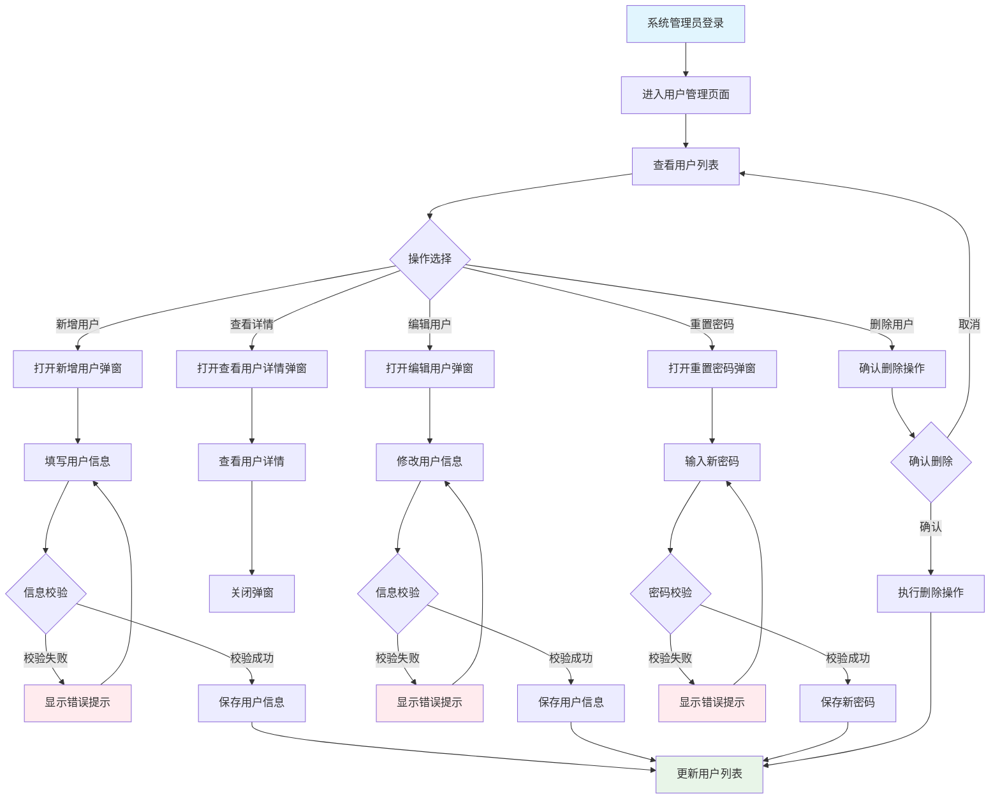

> **生成元信息**（由流程写入，请勿手工修改）
> 基于：
> - `项目战略规划/原始需求.md` @ `sha256:d535e7271c18`
> 生成于：2026-09-10 17:41
>
> *（以上为**示例值** —— 实际使用中由 `product-workflow/scripts/check_freshness.py --stamp` 生成，用于判定本文档是否因上游变更而陈旧。）*

> **范例说明（先读这条）**
> 本文档是用**早期（V1）版**产品设计规范产出的真实范例，价值在于**章节顺序、详细程度、字段与交互的写法**。
> 它的**排版其实是合规的**：页面主体 2 张表（交互矩阵 + 字段字典），4 个弹窗各 2 张表 —— 符合「每个页面/弹窗 ≤2 张表」。
> **用 `scripts/validate_design_doc.py` 校验只剩 1 个 FAIL，这是预期行为，不是范例抄错了：**
> - `C14`：全文没有 AC 验收标准编号（V1 时期没有 AC 体系）
> （`C11` 已不再是问题：线框图中的 `▼ ○ ● □ ☑ ☐` 现属规范允许的单宽几何符号。）
> **结构提示**：开头四章（`需求业务背景` / `功能现状` / `功能梳理` / `功能详细描述`）就是「② 设计初始化（版本 B）」作为**前置章节**并入本文档的实例 —— 即 ①②③ 子阶段的产出**不单独建文件**，统一并进产品设计文档；这三章**按需**、不参与阶段检查。本范例未包含 ① 需求说明与 ③ 功能清单，实际项目中若需要也放同一位置。
> 写新文档时以当前规范为准：页面线框图用 ASCII 字符（`+ - |`）绘制、**不用 emoji**，状态标记可用 `▼ □ ☑ ☐ ● ○` 等单宽几何符号或文字标签（`(o)` `(!)` `[编辑]`）；
> 每个页面/弹窗/步骤/tab 都要有「验收标准」并带 `AC-<模块缩写>-<两位序号>` 编号（写法见 `product-design-spec.md` 第 6 节）。

# 需求业务背景
## 业务诉求
客户希望能通过系统进行添加、编辑用户，查看用户详情，重置密码等操作。

## 概念说明


# 功能现状
## 功能当前状态
目前已有用户管理功能，包括添加用户、编辑用户、查看用户详情的按钮。
## 数据当前状态
目前系统中已存储用户的基本信息，包括用户名、密码、手机号、邮箱等。但是没有添加用户、编辑用户、查看用户详情的操作页面。

# 功能梳理
## 功能实现思路
- 添加用户：在用户管理页面点击添加用户按钮，填写用户信息，提交后添加到系统中。
- 编辑用户：在用户管理页面点击编辑用户按钮，填写用户信息，提交后更新系统中的用户信息。
- 查看用户详情：在用户管理页面点击用户详情按钮，查看该用户的详细信息。
- 重置密码：在用户管理页面点击重置密码按钮，输入新密码，提交后重置该用户的密码。

## 事项拆解
1添加用户：
- 涉及页面路径：用户管理页面
- 事项描述：点击添加用户按钮，填写用户信息，提交后添加到系统中。
2编辑用户：
- 涉及页面路径：用户管理页面
- 事项描述：点击编辑用户按钮，填写用户信息，提交后更新系统中的用户信息。
3查看用户详情：
- 涉及页面路径：用户管理页面
- 事项描述：点击用户详情按钮，查看该用户的详细信息。
4重置密码：
- 涉及页面路径：用户管理页面
- 事项描述：点击重置密码按钮，输入新密码和确认密码，提交后重置该用户的密码。
# 功能详细描述
    - 添加用户：
        - 弹窗填写用户名、密码、手机号、邮箱等信息。
        - 点击提交按钮，将用户信息添加到系统中。
    - 编辑用户：
        - 弹窗填写用户名、手机号、邮箱等信息。
        - 点击提交按钮，将用户信息更新到系统中。
    - 查看用户详情：
        - 弹窗显示用户名、手机号、邮箱等信息。
    - 重置密码：
        - 弹窗输入新密码、确认密码。
        - 点击提交按钮，将用户密码重置为新密码。

## 业务流程

用户管理模块的核心业务流程如下：



## 页面清单

| 页面名称 | 页面路径 | 页面描述 | 主要栏目 | 数据流向 | 包含元素 | 其他 |
| -------- | -------- | -------- | -------- | -------- | -------- | -------- |
| 用户管理 | 系统管理 > 用户管理 | 管理系统用户的创建、编辑、删除、查看详情和重置密码，支持用户状态管理和批量操作 | 查询筛选区、操作按钮区、用户列表区、分页区 | 输入：用户查询条件、用户信息；输出：用户列表数据、操作结果反馈 | 查询筛选栏、用户数据列表、新增用户弹窗、编辑用户弹窗、查看详情弹窗、重置密码弹窗、分页组件 | 与角色管理、分组管理页面数据关联 |
| 角色管理 | 系统管理 > 角色管理 | 管理系统角色的创建、编辑、删除和权限配置 | 查询筛选区、操作按钮区、角色列表区、分页区 | 输入：角色查询条件、角色信息；输出：角色列表数据、操作结果反馈 | 查询筛选栏、角色数据列表、新增角色弹窗、编辑角色弹窗、权限配置弹窗、分页组件 | 为用户管理提供角色数据源 |
| 分组管理 | 系统管理 > 分组管理 | 管理用户分组的创建、编辑、删除和用户分配 | 查询筛选区、操作按钮区、分组列表区、分页区 | 输入：分组查询条件、分组信息；输出：分组列表数据、操作结果反馈 | 查询筛选栏、分组数据列表、新增分组弹窗、编辑分组弹窗、用户分配弹窗、分页组件 | 为用户管理提供分组数据源 |

## 功能设计详情

### 用户管理页面

#### 功能基本信息

- **页面标题**：用户管理
- **页面路径**：系统管理 > 用户管理

#### 功能概述

- **页面目标与定位**：为系统管理员提供完整的用户生命周期管理功能，包括用户的创建、查看、编辑、删除和密码重置，确保系统用户的规范化管理。
- **功能状态**：🔄 调整功能：基于现有功能进行优化和完善。
- **数据展示与用户操作**：以用户列表为核心展示所有系统用户信息，支持多维度查询筛选，提供行级和页面级操作满足不同管理需求。
- **列表核心地位**：用户列表作为页面主体，所有用户管理操作都围绕列表展开，操作完成后实时更新列表状态，确保数据一致性和操作闭环。

#### 数据流

##### 输入 (Inputs)
- **用户查询条件**：用户手动输入的筛选条件（用户名、部门、状态），用于列表数据筛选
- **用户基本信息**：管理员在弹窗表单中输入的用户数据，包括用户名、密码、姓名、部门、邮箱、手机号等必填和选填字段
- **分页参数**：用户操作的页码和每页条目数，用于列表数据分页加载

##### 处理 (Processing)
- **数据校验**：对用户输入的信息进行格式校验、长度校验、唯一性校验等业务规则验证
- **权限检查**：验证当前操作用户是否具有相应的用户管理权限
- **状态转换**：处理用户状态变更时的业务逻辑

##### 输出 (Outputs)
- **用户列表数据**：经过筛选和分页的用户信息列表，展示给管理员查看
- **操作结果反馈**：各类操作的成功或失败提示信息，指导用户下一步操作
- **审计日志记录**：用户管理操作的详细日志，用于安全审计和问题追溯

#### 页面布局设计详情

##### 页面布局图

```
+-------------------------------------------------------------+
| 首页 | 业务管理 | **系统管理** | 数据管理 | 其他模块     [管理员] [设置] |
+-------------------------------------------------------------+
| 首页 > 系统管理 > 用户管理                                 |
+-------------------------------------------------------------+
| 用户管理                                                    |
+-------------------------------------------------------------+
| 用户名:[____] 部门:[全部▼] 状态:[全部▼] [搜索] [重置] [新增用户] [批量删除] [导出] |
+=============================================================+
|| □ | 用户名    | 姓名      | 部门     | 邮箱        | 手机号      | 状态   | 操作           ||
||===========================================================||
|| ☑ | user1    | 用户1     | 研发部   | user1@xx.com | 13812340001 | 在职   | [编辑][查看][重置密码][删除] ||
|| ☐ | user2    | 用户2     | 产品部   | user2@xx.com | 13812340002 | 离职   | [编辑][查看][重置密码][删除] ||
|| ☑ | user1    | 用户1     | 研发部   | user1@xx.com | 13812340001 | 在职   | [编辑][查看][重置密码][删除] ||
|| ☐ | user2    | 用户2     | 产品部   | user2@xx.com | 13812340002 | 离职   | [编辑][查看][重置密码][删除] ||
|| ☑ | user1    | 用户1     | 研发部   | user1@xx.com | 13812340001 | 在职   | [编辑][查看][重置密码][删除] ||
|| ☐ | user2    | 用户2     | 产品部   | user2@xx.com | 13812340002 | 离职   | [编辑][查看][重置密码][删除] ||
|| ☑ | user1    | 用户1     | 研发部   | user1@xx.com | 13812340001 | 在职   | [编辑][查看][重置密码][删除] ||
|| ☐ | user2    | 用户2     | 产品部   | user2@xx.com | 13812340002 | 离职   | [编辑][查看][重置密码][删除] ||
|| ☑ | user1    | 用户1     | 研发部   | user1@xx.com | 13812340001 | 在职   | [编辑][查看][重置密码][删除] ||
|| ☐ | user2    | 用户2     | 产品部   | user2@xx.com | 13812340002 | 离职   | [编辑][查看][重置密码][删除] ||
+=============================================================+
|              共 35 条  [上一页] 1 2 3 4 5 [下一页]         |
+-------------------------------------------------------------+
```

##### 功能区清单

- 查询筛选区：用户名输入框、部门下拉选择、状态下拉选择、搜索按钮、重置按钮
- 页面操作区：新增用户按钮、批量删除按钮、导出按钮
- 列表区：用户数据列表；行级操作：编辑、查看、重置密码、删除
- 分页区：每页条目数、页码切换、跳页
- 状态展示：加载中、空数据、加载失败、选择态（勾选行）

##### 交互矩阵（页面内）

| 交互点 | 触发条件 | 系统行为与逻辑 | 页面反馈/状态变化 | 异常/边界 |
| --- | --- | --- | --- | --- |
| 页面初始化 | 进入页面 | 拉取用户列表（默认筛选+默认分页） | 列表进入加载态；返回后渲染数据 | 失败进入错误态并提供重试 |
| 搜索（主要按钮） | 点击“搜索” | 按当前筛选条件查询列表 | 列表加载态→渲染结果；分页回到第1页 | 查询失败提示并保留原列表 |
| 重置（次要按钮） | 点击“重置” | 清空筛选条件并恢复默认值 | 更新筛选控件；触发默认查询 | 本地可先重置控件 |
| 新增用户（主按钮） | 点击“新增用户” | 打开新增用户弹窗；初始化默认值 | 弹窗打开；遮罩显示 | 打开失败提示 |
| 编辑（行级） | 点击行内“编辑” | 拉取用户详情并打开编辑弹窗 | 弹窗打开并回填字段 | 详情失败提示且不打开弹窗 |
| 查看（行级） | 点击行内“查看” | 拉取用户详情并打开查看弹窗 | 弹窗打开并显示字段 | 详情失败提示且不打开弹窗 |
| 重置密码（行级） | 点击行内“重置密码” | 打开重置密码弹窗 | 弹窗打开 | - |
| 删除（行级，危险操作） | 点击行内“删除”并二次确认 | 校验可删条件后执行删除 | 成功：刷新列表并提示；失败：提示原因 | 不可逆；需处理无权限/被依赖 |
| 批量删除（次按钮） | 勾选多行后点击“批量删除”并二次确认 | 提交批量删除请求 | 成功：刷新列表；失败：提示失败明细 | 未选中时按钮置灰/提示 |
| 导出（次按钮） | 点击“导出” | 生成并下载用户列表文件 | 文件下载开始；成功提示 | 导出失败提示 |
| 分页切换 | 点击页码/上一页/下一页/跳页 | 以当前筛选条件+分页参数查询 | 列表加载态→渲染新页 | 超出范围需校正 |
| 每页条目数 | 切换每页条目数 | 更新pageSize并回到第1页查询 | 列表加载态→渲染 | - |
| 空数据态 | 查询结果为空 | - | 展示空态文案与引导（可引导新增） | - |
| 错误态 | 列表请求失败 | - | 展示错误态与重试入口 | 重试仍失败则保留错误态 |

##### 字段字典（查询字段 + 列表字段）

| 所属区域 | 字段(标签/字段名) | 类型/控件 | 必填/校验 | 默认/初始 | 来源/备注 |
| --- | --- | --- | --- | --- | --- |
| 查询筛选区 | 用户名 / username | 字符串 / input | 非必填；模糊匹配 | 空 | 用户输入；支持实时搜索建议 |
| 查询筛选区 | 部门 / department | 枚举 / select | 非必填；选项：全部/研发部/产品部/市场部 | 全部 | 固定枚举 |
| 查询筛选区 | 状态 / status | 枚举 / select | 非必填；选项：全部/在职/离职 | 全部 | 固定枚举 |
| 列表区 | 选择框 / - | 布尔值 / checkbox | - | 未选中 | 用于批量操作 |
| 列表区 | 用户名 / username | 文本 / text | 必显；3-20字符（创建校验） | - | 唯一性校验 |
| 列表区 | 姓名 / realName | 文本 / text | 必显；1-50字符（创建校验） | - | - |
| 列表区 | 部门 / department | 文本 / text | 必显 | - | - |
| 列表区 | 邮箱 / email | 文本 / text | 必显；邮箱格式（创建校验） | - | 唯一性校验 |
| 列表区 | 手机号 / mobile | 文本 / text | 必显；手机号格式（创建校验） | - | 唯一性校验 |
| 列表区 | 状态 / status | 枚举 / tag | 必显；在职/离职 | - | 影响登录权限 |
| 列表区 | 操作 / - | 操作按钮组 / - | - | - | 编辑、查看、重置密码、删除 |

#### 弹窗/表单设计详情

##### 新增用户弹窗

###### 弹窗布局图

```
+-------------------------------------------------------------+
| 新增用户                                                [×] |
+-------------------------------------------------------------+
| 请填写用户基本信息                                          |
|                                                             |
|  用户名: [__________] *                                    |
|  密码:   [__________] *                                    |
|  姓名:   [__________] *                                    |
|  部门:   [选择部门 ▼] *                                    |
|  邮箱:   [__________] *                                    |
|  手机号: [__________] *                                    |
|  状态:   (●在职) (○离职) *                                 |
|                                                             |
+-------------------------------------------------------------+
|                       [取消]          [确认]                |
+-------------------------------------------------------------+
```

###### 弹窗概要

- 触发：用户管理页面点击“新增用户”
- 尺寸：中等尺寸弹窗（表单为主）
- 关闭：取消/右上角关闭(×)/点击遮罩（等同取消，丢弃未提交数据）
- 提交口径：仅当表单整体验证通过才允许提交
- 默认值：状态=在职

###### 字段字典（弹窗表单）

| 所属区域 | 字段(标签/字段名) | 类型/控件 | 必填/校验 | 默认/初始 | 来源/备注 |
| --- | --- | --- | --- | --- | --- |
| 表单区 | 用户名 / username | 字符串 / input | 必填；3-20字符；字母数字下划线；唯一性 | 空 | 用户输入 |
| 表单区 | 密码 / password | 字符串 / password | 必填；6-20字符；包含字母和数字 | 空 | 用户输入 |
| 表单区 | 姓名 / realName | 字符串 / input | 必填；1-50字符 | 空 | 用户输入 |
| 表单区 | 部门 / department | 枚举 / select | 必填；选项：研发部/产品部/市场部 | 研发部 | 固定枚举 |
| 表单区 | 邮箱 / email | 字符串 / input | 必填；邮箱格式；唯一性 | 空 | 用户输入 |
| 表单区 | 手机号 / mobile | 字符串 / input | 必填；11位手机号格式；唯一性 | 空 | 用户输入 |
| 表单区 | 状态 / status | 枚举 / radio button | 必填；在职/离职 | 在职 | 固定列表 |

###### 交互矩阵（弹窗内）

| 交互点 | 触发条件 | 系统行为与逻辑 | 页面反馈/状态变化 | 异常/边界 |
| --- | --- | --- | --- | --- |
| 打开弹窗 | 点击“新增用户” | 初始化字段默认值；可聚焦首字段 | 弹窗展示；遮罩出现 | 初始化失败提示并不展示弹窗 |
| 实时校验 | 字段输入/失焦 | 执行字段级校验；必要时做唯一性校验（可异步） | 显示错误提示；确认按钮在未通过时禁用 | 异步校验中需有状态提示 |
| 确认（主按钮） | 点击确认且校验通过 | 提交创建请求 | 提交中loading；成功后关闭弹窗并刷新列表 | 失败提示原因；保留输入并保持弹窗开启 |
| 取消（次按钮） | 点击取消 | 关闭弹窗并丢弃未提交数据 | 弹窗关闭 | 可选：未保存修改二次确认 |
| 关闭(×)/遮罩关闭 | 点击×或遮罩 | 等同取消 | 弹窗关闭 | 同上 |

##### 编辑用户弹窗

###### 弹窗布局图

```
+-------------------------------------------------------------+
| 编辑用户                                                [×] |
+-------------------------------------------------------------+
| 请修改用户基本信息                                          |
|                                                             |
|  用户名: [__________] *                                    |
|  姓名:   [__________] *                                    |
|  部门:   [选择部门 ▼] *                                    |
|  邮箱:   [__________] *                                    |
|  手机号: [__________] *                                    |
|  状态:   (●在职) (○离职) *                                 |
|                                                             |
+-------------------------------------------------------------+
|                       [取消]          [确认]                |
+-------------------------------------------------------------+
```

###### 弹窗概要

- 触发：用户管理页面点击行内“编辑”按钮
- 尺寸：中等尺寸弹窗（表单为主）
- 关闭：取消/右上角关闭(×)/点击遮罩（等同取消，丢弃未提交数据）
- 提交口径：仅当表单整体验证通过才允许提交
- 默认值：回填当前用户信息

###### 字段字典（弹窗表单）

| 所属区域 | 字段(标签/字段名) | 类型/控件 | 必填/校验 | 默认/初始 | 来源/备注 |
| --- | --- | --- | --- | --- | --- |
| 表单区 | 用户名 / username | 字符串 / input | 必填；3-20字符；字母数字下划线；唯一性 | 回填 | 用户输入 |
| 表单区 | 姓名 / realName | 字符串 / input | 必填；1-50字符 | 回填 | 用户输入 |
| 表单区 | 部门 / department | 枚举 / select | 必填；选项：研发部/产品部/市场部 | 回填 | 固定枚举 |
| 表单区 | 邮箱 / email | 字符串 / input | 必填；邮箱格式；唯一性 | 回填 | 用户输入 |
| 表单区 | 手机号 / mobile | 字符串 / input | 必填；11位手机号格式；唯一性 | 回填 | 用户输入 |
| 表单区 | 状态 / status | 枚举 / radio button | 必填；在职/离职 | 回填 | 固定列表 |

###### 交互矩阵（弹窗内）

| 交互点 | 触发条件 | 系统行为与逻辑 | 页面反馈/状态变化 | 异常/边界 |
| --- | --- | --- | --- | --- |
| 打开弹窗 | 点击“编辑”按钮 | 拉取用户详情并打开编辑弹窗 | 弹窗打开并回填字段 | 详情失败提示且不打开弹窗 |
| 实时校验 | 字段输入/失焦 | 执行字段级校验；必要时做唯一性校验（可异步） | 显示错误提示；确认按钮在未通过时禁用 | 异步校验中需有状态提示 |
| 确认（主按钮） | 点击确认且校验通过 | 提交更新请求 | 提交中loading；成功后关闭弹窗并刷新列表 | 失败提示原因；保留输入并保持弹窗开启 |
| 取消（次按钮） | 点击取消 | 关闭弹窗并丢弃未提交数据 | 弹窗关闭 | 可选：未保存修改二次确认 |
| 关闭(×)/遮罩关闭 | 点击×或遮罩 | 等同取消 | 弹窗关闭 | 同上 |

##### 查看用户详情弹窗

###### 弹窗布局图

```
+-------------------------------------------------------------+
| 用户详情                                                  [×] |
+-------------------------------------------------------------+
| 用户基本信息                                                |
|                                                             |
|  用户名: user1                                              |
|  姓名:   用户1                                              |
|  部门:   研发部                                             |
|  邮箱:   user1@example.com                                  |
|  手机号: 13812340001                                        |
|  状态:   在职                                               |
|                                                             |
+-------------------------------------------------------------+
|                             [关闭]                         |
+-------------------------------------------------------------+
```

###### 弹窗概要

- 触发：用户管理页面点击行内“查看”按钮
- 尺寸：小尺寸弹窗（信息展示为主）
- 关闭：关闭按钮/右上角关闭(×)/点击遮罩
- 提交口径：无提交操作
- 默认值：回填当前用户信息

###### 字段字典（弹窗展示）

| 所属区域 | 字段(标签/字段名) | 类型/控件 | 必填/校验 | 默认/初始 | 来源/备注 |
| --- | --- | --- | --- | --- | --- |
| 展示区 | 用户名 / username | 文本 / text | - | 回填 | - |
| 展示区 | 姓名 / realName | 文本 / text | - | 回填 | - |
| 展示区 | 部门 / department | 文本 / text | - | 回填 | - |
| 展示区 | 邮箱 / email | 文本 / text | - | 回填 | - |
| 展示区 | 手机号 / mobile | 文本 / text | - | 回填 | - |
| 展示区 | 状态 / status | 文本 / text | - | 回填 | - |

###### 交互矩阵（弹窗内）

| 交互点 | 触发条件 | 系统行为与逻辑 | 页面反馈/状态变化 | 异常/边界 |
| --- | --- | --- | --- | --- |
| 打开弹窗 | 点击“查看”按钮 | 拉取用户详情并打开查看弹窗 | 弹窗打开并显示字段 | 详情失败提示且不打开弹窗 |
| 关闭（主要按钮） | 点击“关闭”按钮 | 关闭弹窗 | 弹窗关闭 | - |
| 关闭(×)/遮罩关闭 | 点击×或遮罩 | 关闭弹窗 | 弹窗关闭 | - |

##### 重置密码弹窗

###### 弹窗布局图

```
+-------------------------------------------------------------+
| 重置密码                                                  [×] |
+-------------------------------------------------------------+
| 请输入新密码                                                |
|                                                             |
|  新密码:   [__________] *                                   |
|  确认密码: [__________] *                                   |
|                                                             |
+-------------------------------------------------------------+
|                       [取消]          [确认]                |
+-------------------------------------------------------------+
```

###### 弹窗概要

- 触发：用户管理页面点击行内“重置密码”按钮
- 尺寸：小尺寸弹窗（表单为主）
- 关闭：取消/右上角关闭(×)/点击遮罩（等同取消，丢弃未提交数据）
- 提交口径：仅当表单整体验证通过才允许提交
- 默认值：无

###### 字段字典（弹窗表单）

| 所属区域 | 字段(标签/字段名) | 类型/控件 | 必填/校验 | 默认/初始 | 来源/备注 |
| --- | --- | --- | --- | --- | --- |
| 表单区 | 新密码 / newPassword | 字符串 / password | 必填；6-20字符；包含字母和数字 | 空 | 用户输入 |
| 表单区 | 确认密码 / confirmPassword | 字符串 / password | 必填；与新密码一致 | 空 | 用户输入 |

###### 交互矩阵（弹窗内）

| 交互点 | 触发条件 | 系统行为与逻辑 | 页面反馈/状态变化 | 异常/边界 |
| --- | --- | --- | --- | --- |
| 打开弹窗 | 点击“重置密码”按钮 | 打开重置密码弹窗 | 弹窗打开 | - |
| 实时校验 | 字段输入/失焦 | 执行字段级校验；确认密码与新密码一致性校验 | 显示错误提示；确认按钮在未通过时禁用 | - |
| 确认（主按钮） | 点击确认且校验通过 | 提交重置密码请求 | 提交中loading；成功后关闭弹窗并刷新列表 | 失败提示原因；保留输入并保持弹窗开启 |
| 取消（次按钮） | 点击取消 | 关闭弹窗并丢弃未提交数据 | 弹窗关闭 | 可选：未保存修改二次确认 |
| 关闭(×)/遮罩关闭 | 点击×或遮罩 | 等同取消 | 弹窗关闭 | 同上 |
