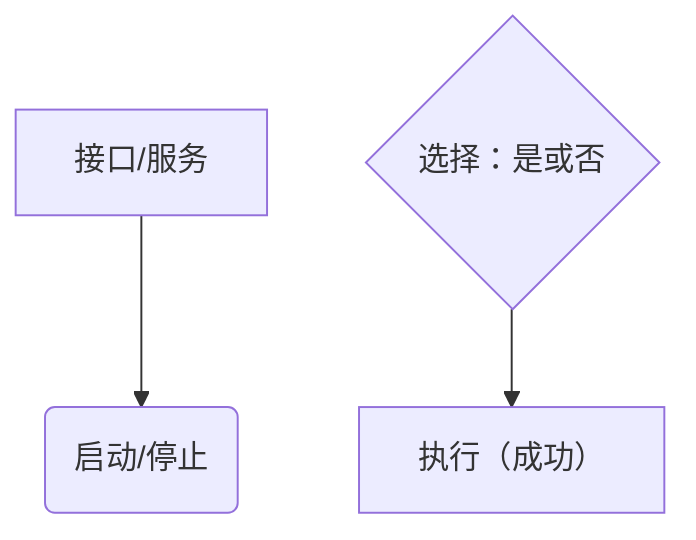
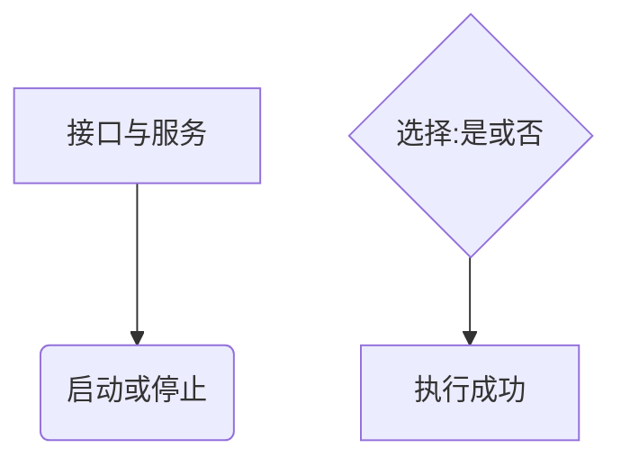
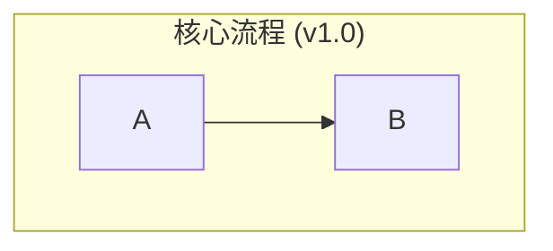
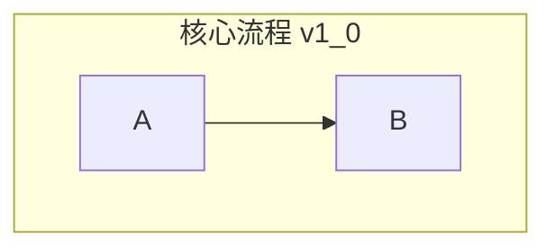

# Mermaid 图表绘制规范与避错指南

> 本规范用于本 skill 族所有需要绘制流程 / 架构 / 状态 / ER 图的场合。
> **版本立场**：不绑定任何具体 Mermaid 版本。以下规则是「稳健写法」——对旧渲染器（v8 系列）是**必需**，对新渲染器（v10 / v11+）是**良好习惯**。当无法确认目标环境的渲染版本时，一律按本规范的最严标准执行。

## 1. 核心原则：规避非 ASCII 字符与符号

渲染引擎对非标准 ASCII 字符（尤其是中文全角标点）的容错度在不同版本间差异很大。使用全角标点是**最常见、代价最高**的渲染失败原因。

### 绝对禁止使用的符号（Do Not Use）

在图表的任何代码部分（节点文字、标题、注释、子图名）都**绝对不能**使用：

- **全角括号**：`（` `）`
- **全角引号**：`“` `”` `‘` `’`
- **全角逗号与句号**：`，` `。`
- **全角冒号**：`：`
- **其他全角标点**：`；` `？` `！` 等

### 强烈建议规避的符号（Avoid if Possible）

- **斜杠 `/`**：尤其在节点文字或枚举值描述中，建议改用逗号 `,` 或「或」字。
- **特殊空格**：确保所有空格都是标准半角空格（谨防从 Word / 网页粘贴带入的不换行空格）。
- **括号 `()` `[]` `{}`**：在节点文字内部出现会与 Mermaid 自身的形状语法冲突，务必避免——这是仅次于全角标点的第二大踩坑点。

**错误示例（可能渲染失败或形状错乱）**

**正确示例（推荐写法）**

## 2. 流程图关键字

- **优先使用 `graph TD` / `graph LR`**，而非新名称 `flowchart`。`graph` 的兼容面更宽；在旧渲染器上 `flowchart` 曾存在样式应用的渲染 bug。除非团队已统一到新版渲染器并明确要求 `flowchart`，否则一律用 `graph`。
- 节点 ID 只用**半角字母数字与下划线**，不要用中文或全角字符做 ID。
- 连线标签统一写在 `-->|标签|` 内，避免裸写。

## 3. 子图（subgraph）

- **不要依赖 `direction`**：部分渲染版本不支持 `subgraph` 内部的方向声明，子图会继承顶层方向。若要表达分组内部方向，改为拆成两张图或调整节点排布。
- **子图标题同样受第 1 节符号禁忌约束**，且不要使用 `()`。

**错误示例**

**正确示例**

## 4. 其他图表类型约定

| 图表 | 关键字 | 约定 |
|---|---|---|
| 业务流程图 | `graph TD` / `graph LR` | 多角色场景优先用泳道图；节点文字遵守第 1 节 |
| 泳道图 | `graph TD` + `subgraph` 分泳道 | 见上；PlantUML 版本为可选替代，见 `swimlane-guide.md` |
| ER 图 | `erDiagram` | 表名与字段用 snake_case；关系标签用中文，不加括号 |
| 时序图 | `sequenceDiagram` | 参与者名不用全角标点 |
| 状态图 | `stateDiagram-v2` | 状态名用英文或中文，不加括号 |

## 5. 交付前自检清单

- [ ] 全文无全角括号 / 引号 / 逗号 / 句号 / 冒号
- [ ] 节点文字内无 `()` `[]` `{}`
- [ ] 节点 ID 仅用半角字母数字下划线
- [ ] 流程图用 `graph` 而非 `flowchart`
- [ ] 子图未使用 `direction`
- [ ] 代码块语言标注为 `mermaid`
- [ ] 在目标渲染环境中实际渲染过一次，无报错
